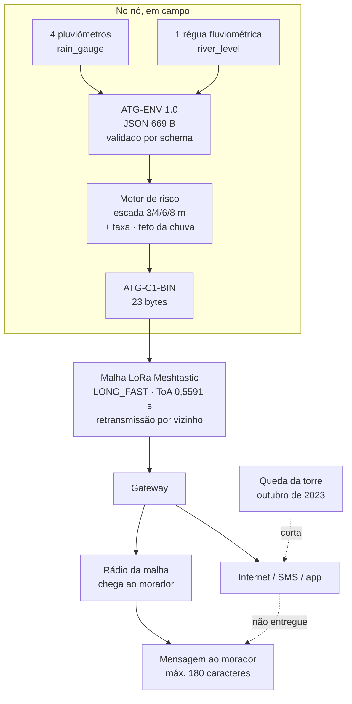

# Americas TechGuard

**Alerta de enchente que continua funcionando quando a torre cai.**

Uma cadeia completa, do sensor ao celular do morador, para o Rio Itajaí-Açu em
Blumenau (SC): sensores em rede *mesh* LoRa, um formato de fio de **23 bytes**,
um motor de risco ancorado na escada oficial da Defesa Civil, e a mensagem em
português que chega a quem precisa sair de casa.

Reconstruído sobre o evento real de **04 a 14 de outubro de 2023**: 1.297
leituras, 36 transições de alerta, pico de cota em 09/10.

### ▶ [Abrir a demonstração no navegador](https://roseborges44.github.io/Americas-TechGuard-Final/)

Nada para instalar. Também funciona **offline**: baixe o repositório e abra
`index.html` com um duplo clique, com o Wi-Fi desligado.

| | |
|---|---|
| **Demonstração ao vivo** | https://roseborges44.github.io/Americas-TechGuard-Final/ |
| **Autora** | Rosemeri Borges, Centro Universitário SENAI/SC (Florianópolis) |
| **Licença** | MIT (ver `LICENSE`) |

> **Como este repositório trata a verdade.** Todo bloco do sistema carrega um
> selo: ✅ dado real e implementado · 🔶 simulado ou aproximação declarada ·
> ⬜ integração futura, não implementada. A demonstração exibe esses selos na
> tela, com a contagem. Nada simulado é apresentado como real. Onde há
> limitação, ela está escrita, inclusive quando é desfavorável.

---

## 1. Abstract

Flash floods in the Itajaí-Açu valley (Blumenau, Santa Catarina, Brazil) are
recurrent and lethal, and the alert chain fails precisely when it is most
needed: cellular towers and internet links go down while the river is still
rising. Americas TechGuard is an end-to-end early-warning chain that does not
depend on that infrastructure. Environmental readings travel over a LoRa
Meshtastic network as a 23-byte binary frame (ATG-C1-BIN), a 29-fold reduction
from the 669-byte canonical JSON, which is what makes the message fit inside the
radio duty cycle. A risk engine anchored on the official Blumenau Civil Defence
stage ladder (3, 4, 6 and 8 metres), escalated by rate of rise and capped for
rainfall, turns each reading into a plain-Portuguese instruction for residents.
The chain was reconstructed over the real October 2023 flood: 1,297 payloads,
36 alert transitions, a derived peak stage of 9.93 m against the 10.19 m
observed by the Civil Defence, an error of 0.26 m (2.6%). The mesh delivered
100% of packets where an equivalent star topology delivered 90.36% overall and
only 52.7% at the most distant node. The codec is implemented three times, in
Python, C++ for ESP32 and JavaScript, and byte-level parity across
implementations is verified over all 1,297 payloads.

*O desempenho neste projeto será reportado à Partners of the Americas e ao
U.S. State Department.*

---

## 2. O problema e quem é o usuário

Blumenau alaga. Quando o Itajaí-Açu passa dos 8 metros, a Defesa Civil declara
alerta máximo e as áreas de risco precisam ser evacuadas. O aviso existe, mas
depende de energia, de torre de celular e de internet, e é exatamente isso que
falha durante o evento. Uma cheia grande derruba a infraestrutura de
comunicação junto com o resto.

Há dois usuários, com necessidades diferentes:

- **O morador da área de risco.** Não quer um gráfico. Quer saber se sai de casa
  agora e para onde vai. A mensagem tem de ser curta, em português, com a
  instrução na primeira linha e um telefone de emergência.
- **A Defesa Civil.** Precisa do dado bruto, do estágio oficial correspondente e
  da certeza de que a leitura é confiável, para decidir a evacuação. Precisa
  também que um sistema novo não gere alarme falso, porque alarme falso destrói
  a credibilidade do alerta verdadeiro.

A tese deste projeto é que a comunicação, não a previsão, é o elo fraco. Por
isso o esforço central está em fazer o alerta caber em 23 bytes e viajar por uma
malha que sobrevive à queda de um nó.

> **Contexto histórico:** os números de enchentes registradas em Blumenau e as
> vítimas de 2008 são citados no relatório da Semana 4 e não foram reconferidos
> para este documento. Ficam fora daqui de propósito, para que nenhum número
> deste README esteja sem lastro.

---

## 3. Arquitetura



O caminho por internet é o que cai quando a torre cai. O caminho pela malha é o
que continua entregando, e é essa a tese do projeto. A demonstração mostra os
dois canais lado a lado, com o contador de mensagens não entregues em cada um.

O que cada etapa garante:

1. **ATG-ENV 1.0** é o formato rico, legível, validado por JSON Schema. Payload
   que não passa no schema não entra na malha: um nó com leitura inválida fica
   em silêncio em vez de transmitir lixo que o gateway leria como risco.
2. **O motor de risco** decide na origem, no nó, não no servidor. Se a malha
   entregar apenas um pacote, esse pacote já carrega a classificação.
3. **ATG-C1-BIN** é o formato de fio. Os 23 bytes são o que permite respeitar o
   *duty cycle* do rádio e retransmitir várias vezes sem congestionar o canal.
4. **A malha** entrega por caminhos alternativos. É aqui que o projeto se separa
   de uma topologia estrela, que morre com o gateway.

---

## 4. Dois caminhos de execução

### Navegador: zero instalação

Abra **`index.html`** com um duplo clique. Funciona **offline**: sem CDN, sem
servidor, sem chamada de rede. Desligue o Wi-Fi para confirmar.

A tela reconstrói o evento de outubro de 2023 em uma única vista: a régua
fluviométrica subindo com a escada da Defesa Civil, o mapa HAND inundando por
cota (com vista 2.5D), o hidrograma com a chuva e um marcador arrastável, o
quadro de 23 bytes sendo montado e decodificado ao vivo, as métricas da malha e
o celular do morador com a mensagem verbatim. Há controles de reprodução
(1x, 8x, 60x), o botão **Queda da torre** e o botão **Verificar paridade**, que
roda os 1.297 payloads no próprio navegador.

Dois instantes convivem na tela, de propósito: a **régua mostra a série
contínua**, interpolada entre as leituras horárias, e o **quadro ATG-C1 mostra o
último pacote efetivamente recebido**. Os dois podem divergir alguns
centímetros, e isso é o comportamento correto de uma malha que transmite de hora
em hora. Cada painel carrega um rótulo dizendo qual dos dois ele exibe.

Quando o rio sobe, o celular acrescenta o **horizonte temporal**: o tempo
estimado até o próximo degrau da escada oficial, derivado na recepção a partir
da taxa que veio no quadro. É extrapolação linear, não previsão de modelo, e a
limitação 9 explica quando ela aparece e por que é frágil.

Recomendado tela cheia (F11) em telas de 1366x768.

### Python: o pipeline de referência

```bash
pip install -r python/requirements.txt
python -m pytest python/tests -q
```

Saída esperada: **30 passed**.

Os 30 testes precisam apenas de `pytest` e `jsonschema`. As demais dependências
do `python/requirements.txt` (numpy, pandas, scipy, matplotlib) servem aos scripts de
ingestão e de figuras em `python/scripts/`.

### Paridade JavaScript contra Python

```bash
python tests/gen_ref.py     # gera tests/ref.json com os hexes do codec Python
node tests/parity.mjs       # recomputa em JS e compara payload por payload
```

Saída esperada:

```
ATG-C1-BIN, 23 bytes : 1297/1297 identicos  OK
risk_level           : 1296/1297 identicos  (1 divergencia(s))
pico do evento: 9.928 m em 2023-10-09T00:00:00Z
quadro no radio: 1106006ca780422365d44065fefc4d13fde1030900034e  (23 bytes)
```

A divergência única de `risk_level` está explicada na seção 10 e é conhecida.

---

## 5. Dados de entrada e proveniência

| Fonte | O que fornece | Selo |
|---|---|---|
| **ERA5-Land** (Open-Meteo) | chuva horária nas 4 estações e a climatologia de 6 anos que define os limiares | ✅ |
| **GloFAS** (Open-Meteo) | vazão diária na célula (-26,9187, -48,9665) e 10.756 dias de climatologia | ✅ |
| **AlertaBlu / Defesa Civil de Blumenau** | a escada oficial de estágios (3, 4, 6, 8 m) e a cota observada de 10,19 m | ✅ |
| **HAND** (Semana 6) | raster de altura acima da drenagem, EPSG:4326, ~30 m | ✅ |
| Curva-chave vazão para cota | mapeamento monotônico por percentil | 🔶 |

Execução registrada em `python/outputs/run.log`. Semente **42**, preset
**LONG_FAST**, região **ANZ**.

| Métrica da execução | Valor |
|---|---|
| Janela | 2023-10-04 a 2023-10-14 |
| Payloads | **1.297** (1.297 válidos, 0 rejeitados) |
| Distribuição de risco | safe 760 · attention 427 · alert 71 · critical 39 |
| Transições de alerta | **36** (maior mensagem: 180 caracteres) |

Os cinco nós emissores:

| Nó | Tipo | Lat | Lon | Payloads |
|---|---|---|---|---|
| ATG-BLU-01 Vila Itoupava | rain_gauge | -26,7550 | -49,0906 | 264 |
| ATG-BLU-02 Itoupava Central | rain_gauge | -26,8331 | -49,1024 | 264 |
| ATG-BLU-04 Garcia | rain_gauge | -26,9401 | -49,0678 | 264 |
| ATG-BLU-05 Velha | rain_gauge | -26,9219 | -49,1043 | 264 |
| ATG-BLU-06 Prainha (régua) | river_level | -26,9187 | -49,0665 | 241 |

### Integridade dos dados

A proveniência é verificável por hash, não por confiança:

- `python/outputs/payloads.jsonl` tem **951.232 bytes** e SHA-256
  `d530a69113c9aad6d828aea10e3b4be2e38a2c597c5333b1e13a338e5e3a4ad6`.
  É o mesmo arquivo publicado no repositório da Semana 8.
- `data/event.json` guarda esse hash em `meta.source_sha256` e um segundo hash,
  `meta.sha256_preserved`, sobre os 17 campos que a compactação preserva. O
  gerador aborta sem gravar se um único valor divergir.
- O `.gitattributes` deste repositório fixa o terminador de linha em LF. Isso
  não é cosmético: um *checkout* que convertesse para CRLF mudaria o tamanho e o
  hash dos dados de origem e a verificação de proveniência falharia sem que o
  conteúdo tivesse mudado.

Para reproduzir a compactação:

```bash
node tools/build_event.mjs   # regenera data/event.json byte a byte
```

---

## 6. A regra de risco

**Escada oficial da Defesa Civil de Blumenau** (nível absoluto do rio):

| Cota | Estágio | Risco |
|---|---|---|
| ≥ 3 m | observação | attention |
| ≥ 4 m | atenção | attention |
| ≥ 6 m | alerta | alert |
| ≥ 8 m | alerta máximo | critical |

**Escalonamento por taxa de subida:** ≥ 0,25 m/h sobe um degrau, ≥ 0,40 m/h
sobe dois. Ancoragem documentada: na cheia de 04/05/2022 o AlertaBlu registrou
subida média de cerca de 25 cm/h em Blumenau.

**Teto da chuva em `attention`.** A chuva sozinha nunca aciona `alert` nem
`critical`. Só a cota do rio escala acima disso.

Esta regra não é arbitrária, nasceu de um alarme falso real. Com limiares
percentílicos puros, a execução de 12/07 sobre o evento de outubro de 2023
emitia mensagens como *"ALERTA: Chuva 0.0mm/h em Garcia. 24h=54mm"* e *"ALERTA
MAXIMO: Chuva 19.5mm/h em Garcia. 24h=26mm"*: alerta com chuva zero caindo, e
alerta máximo com 26 mm em 24 h. Isso é ruído, e soterra o sinal real, que era o
rio subindo até quase 10 metros. Quem alaga Blumenau é o rio, não a chuva no
telhado. Um sistema que grita o tempo todo é um sistema que ninguém escuta.

O percentil continua sendo o critério, nada foi inventado. O que mudou foi o
teto que a chuva pode acionar sozinha.

**Limiares de chuva**, derivados dos percentis p95, p99 e p99,9 de 6 anos de
climatologia ERA5-Land nas 4 estações (**210.432** amostras horárias, das quais
38.483 horas com chuva e 151.153 janelas de 24 h):

| | atenção | alerta | crítico |
|---|---|---|---|
| 1 h (mm) | 4,1 | 8,7 | 16,85 |
| 24 h (mm) | 27,3 | 46,3 | 92,87 |

O risco final é o **máximo** entre (nível escalonado pela taxa) e (chuva).

---

## 7. Formato de fio: 669 bytes para 23

O ATG-ENV minificado tem **669 bytes** e **não cabe** no `DATA_PAYLOAD_LEN` de
**233 bytes** do Meshtastic. Sem compressão não há sistema.

| Formato | Bytes | |
|---|---|---|
| ATG-ENV 1.0, JSON indentado | 791 | formato rico, para depuração e arquivo |
| ATG-ENV 1.0, JSON minificado | **669** | ainda excede o limite do rádio |
| ATG-C1-JSON | 98 | intermediário legível |
| **ATG-C1-BIN** (bytes crus, PRIVATE_APP) | **23** | o formato de fio |
| ATG-C1-B64 (dentro de TEXT_MESSAGE_APP) | 32 | quando só há canal de texto |
| Mensagem humana de alerta | 119 | o que o morador lê |

Redução de **29 vezes** sobre o JSON minificado.

**Layout ATG-C1-BIN**, `struct` little-endian `<BIIiihhBB`, decodificado sobre o
quadro real do pico:

```
1106006ca780422365d44065fefc4d13fde1030900034e
```

| Offset | Bytes | Campo | Valor no pico |
|---|---|---|---|
| 0 | `11` | versão (4 bits) + sensor (4 bits) | v1 · `river_level` |
| 1 a 4 | `06006ca7` | node_num | 2808872966 |
| 5 a 8 | `80422365` | timestamp Unix | 1696809600 = 09/10/2023 00:00Z |
| 9 a 12 | `d44065fe` | latitude x 1e6 | -26,918700 |
| 13 a 16 | `fc4d13fd` | longitude x 1e6 | -49,066500 |
| 17 a 18 | `e103` | valor x 100 | 993 = **9,93 m** |
| 19 a 20 | `0900` | taxa x 1000 | 9 = +0,009 m/h |
| 21 | `03` | risco | `critical` |
| 22 | `4e` | bateria | 78 % |

O que se perde na compressão está documentado em `data/README.md`: a mensagem de
texto (que vem de `python/outputs/alerts.jsonl`), os campos de rádio que são todos nulos nos
payloads, e as constantes de schema. Nada mais.

---

## 8. Paridade entre três implementações

O codec existe três vezes:

| Implementação | Arquivo | Papel |
|---|---|---|
| **Python** | `python/src/atg_mesh/codec.py` | referência do pipeline |
| **C++ (ESP32)** | `firmware/atg_node.ino` | o nó de campo |
| **JavaScript** | `atg_core.js` | a demonstração no navegador |

Se as três discordarem em um único payload, o sistema está mentindo. Por isso a
paridade é verificada sobre **todos os 1.297 payloads reais**, não sobre uma
amostra:

```
ATG-C1-BIN, 23 bytes : 1297/1297 identicos  OK
risk_level           : 1296/1297 identicos  (1 divergencia)
```

O ponto delicado é o arredondamento. O `round()` do Python é *half-to-even*, o
`Math.round()` do JavaScript é *half-up*. Sem tratar isso, latitude, valor e
taxa divergem em empates de `.5` exato. O JavaScript implementa `pyRound` em
`atg_core.js` para reproduzir o comportamento do Python, e é isso que sustenta o
resultado de 1297/1297 nos bytes.

O navegador também confirma a paridade ao vivo: o botão **Verificar paridade**
recomputa os 1.297 quadros em JavaScript, concatena os hexadecimais e compara o
**SHA-256** contra a referência gerada pelo Python em `tools/parity_ref.py`.

---

## 9. Resultados

### Previsão de cota contra a observação oficial

| | |
|---|---|
| Pico derivado pelo pipeline | **9,93 m** (9,928 m) em 09/10/2023 00:00Z |
| Cota observada pela Defesa Civil **na cheia de 09/10/2023** | **10,19 m** |
| Erro | **0,26 m**, ou 2,6 % |
| Cota das primeiras vias alagadas | 7,4 m |

> A data importa. Outubro de 2023 foi o mês mais chuvoso da história de Blumenau,
> com **quatro** enchentes, e o pico do mês foi mais alto que o desta cheia. Os
> 10,19 m acima são a cota observada **na cheia de 09/10**, que é o evento que
> este pipeline reconstrói. Comparar o resultado com o pico de outro evento do
> mesmo mês seria comparar coisas diferentes.

O pico ficou 0,26 m abaixo do observado, com o nó classificando `critical` e
estágio `alerta_maximo`, ou seja, a decisão operacional (evacuar) foi a mesma
que a Defesa Civil tomou.

### Ganho da malha sobre a topologia estrela

Mesma física de rádio, mesmos nós, mesmo evento. A única diferença é a
retransmissão por vizinho:

| | Malha | Estrela (hop_limit=1) |
|---|---|---|
| PDR geral | **100,0 %** | **90,36 %** |
| PDR em ATG-BLU-01 Vila Itoupava | 100,0 % | **52,7 %** |

O número que importa é o do nó, não o da média. Vila Itoupava é o nó mais
distante do gateway: na topologia estrela ele perde quase metade dos pacotes,
enquanto os outros quatro entregam 100 % e mascaram a falha na média geral. Em
alerta de enchente, o nó que falha é justamente o que fica isolado, e é o que
mais precisa ser ouvido.

E os 52,7 % não são um número solto. O enlace direto de Vila Itoupava ao gateway
tem 18,44 km e margem de apenas **+0,5 dB** sobre o limite de demodulação de
SF 11 (ver `python/outputs/topology.csv`). Com sombreamento log-normal de
sigma 6 dB, a chance de um pacote sobreviver a esse enlace é
`Phi(0,5 / 6) = 53,3 %`. O PDR medido na simulação foi 52,7 %, uma diferença de
0,6 ponto percentual. O nó não falha por azar: ele opera na fronteira exata da
sensibilidade do rádio, e é o sombreamento que decide cada pacote.

A malha resolve isso porque o mesmo nó alcança ATG-BLU-02 Itoupava Central a
8,76 km com margem de +8,8 dB, e o repetidor do Morro do Aipim (ATG-BLU-03) a
16,65 km com +2,1 dB. Com `hop_limit = 3`, deixa de depender do enlace que está
no limite. **Esta é a previsão central que o ensaio de campo precisa derrubar ou
confirmar:** ver `docs/protocolo_ensaio_campo.md`, seção 2.2.

A topologia completa tem sete nós: os cinco emissores acima, o repetidor
ATG-BLU-03 no Morro do Aipim e o gateway ATG-BLU-GW na Defesa Civil. O nó 03 e
o gateway não emitem leituras, e por isso não aparecem na tabela de payloads da
seção 5.

### Rádio

| Métrica | Valor |
|---|---|
| Time on Air, preset LONG_FAST | 0,5591 s |
| Bitrate | 1.074,2 bps |
| Saltos médios | 1,09 |
| Latência mediana / p95 | 0,559 s / 2,382 s |
| RSSI médio / SNR médio | -97,1 dBm / 16,9 dB |
| Transmissões por pacote | 5,97 |

Time on Air por preset: LONG_FAST 0,5591 s · LONG_SLOW 2,2364 s ·
MEDIUM_FAST 0,15 s · SHORT_FAST 0,0452 s.

### A mensagem que chega ao morador

Verbatim de `python/outputs/alerts.jsonl`, no pico, 169 caracteres:

```
[ATG-BLU] ALERTA MAXIMO: Rio Itajai-Acu 9.93m (estavel) em Prainha.
Cota 1as vias 7.4m. Deixe areas de risco AGORA. Procure ponto alto/abrigo.
Emerg 199/193. 08/10 21:00
```

Instrução primeiro, número depois, telefone no fim, sem acento para sobreviver a
qualquer codificação de aparelho.

---

## 10. Limitações conhecidas

Esta seção existe porque um sistema de alerta que esconde os próprios limites é
mais perigoso que um sistema modesto.

**1. A curva-chave é uma aproximação. 🔶**
A conversão de vazão para cota usa um mapeamento monotônico por percentil sobre
10.756 dias de climatologia GloFAS, ancorado nos estágios oficiais do AlertaBlu:
p50 para 1,2 m · p90 para 3,0 m · p97 para 4,0 m · p99,3 para 6,0 m · p99,9 para
8,0 m. **Não é a curva-chave oficial da estação.** Uma curva-chave real exige
medições de vazão e de cota no local. O erro de 0,26 m no pico é a evidência de
quanto a aproximação custa, e não deve ser generalizado para outros eventos.

**2. O GloFAS diário não enxerga duas das três cheias.**
A resolução diária suaviza picos rápidos. Isso significa que a fonte de vazão,
sozinha, não é adequada para alerta antecipatório de subida rápida. É o
argumento mais forte para trocar a fonte pela telemetria de 15 minutos do
AlertaBlu.

**3. A divergência de risco em 1 dos 1.297 payloads.**
O resultado de `risk_level` é 1296/1297, e a causa é conhecida e localizada. O
limiar de 24 h vale `27.300000000000004` em precisão total, mas o
`python/outputs/metrics.json` o publica arredondado a duas decimais, como `27.3`. Existe um
payload com `accum_24h` igual a exatamente `27.3`:

| comparação | resultado | |
|---|---|---|
| `27.3 >= 27.300000000000004` (limiar exato, usado pelo pipeline) | falso, `safe` | igual ao payload gravado |
| `27.3 >= 27.3` (limiar arredondado, lido pela demonstração) | verdadeiro, `attention` | a divergência |

O motor de risco não errou: o pipeline classificou com o limiar em precisão
total. A perda ocorre na exportação do `python/outputs/metrics.json`, que arredonda os seis
limiares (`h1_critical` de 16,8518 para 16,85, `h24_critical` de 92,8696 para
92,87), e só este cai em empate exato. A diferença é da ordem de 1e-15, na
fronteira do ponto flutuante. Optou-se por **documentar em vez de corrigir**,
porque alterar o `python/outputs/metrics.json` publicado na Semana 8 quebraria a proveniência
por hash descrita na seção 5, em troca de um dígito na décima quinta decimal.
Reproduzível a partir de `python/data/raw/rain_era5_climatology.csv` com o mesmo
cálculo de `python/src/atg_mesh/pipeline.py` (numpy 2.2.6, pandas 2.3.0).

**4. O nowcast U-RNN foi treinado em surrogate sintético. 🔶**
O modelo da Semana 7 faz inferência em cerca de 0,36 s, mas foi treinado em
dados sintéticos, não em séries de Blumenau. **Por isso ele não alimenta o
alerta nesta demonstração**, e aparece na tela como ⬜ integração futura.
Nowcasting sobre uma série que não enxerga a cheia prevê a cheia errada. Incluí-
lo no caminho ao vivo tornaria o sistema mais impressionante e menos honesto.

**5. O mapeamento de cota para lâmina d'água é simplificado. 🔶**
O raster HAND é real (Semana 6, EPSG:4326, cerca de 30 m, com 16,75 % da área em
alta suscetibilidade). A lâmina é desenhada consultando o HAND por cota, isto é,
inunda onde HAND é menor que a cota. Não é modelagem hidrodinâmica: não há
propagação, atraso, nem conservação de massa. Ver `docs/roadmap_3d_hidrodinamico.md`.

**6. Não há hardware físico. ⬜**
Nenhuma placa foi montada e nenhum RSSI real foi medido. Os números de rádio
vêm de simulação com a física do preset LONG_FAST. Isto é a limitação mais
importante desta entrega, e por isso o projeto especifica o que mediria:
`docs/protocolo_ensaio_campo.md`.

**7. A queda da torre é um cenário simulado. 🔶**
O botão da demonstração congela o canal por internet para mostrar o contraste
com a malha. É inspirado nas falhas de comunicação documentadas em outubro de
2023, mas não é telemetria de uma queda real.

**8. O SNR simulado considera apenas ruído térmico. 🔶**
O modelo calcula o SNR como `RSSI - piso de ruído`, com piso de **-114,0 dBm**
(`-174 + 10 log10(250 kHz) + 6 dB` de figura de ruído). É por isso que o painel
mostra RSSI médio de -97,1 dBm com SNR médio de 16,9 dB: a diferença é
exatamente os 114 dB do piso, e um sinal de -97,1 dBm está 34,4 dB acima da
sensibilidade de SF 11, que é de -131,5 dBm. O par é coerente **dentro do
modelo**, mas o modelo **não inclui interferência, ruído co-canal nem outras
redes na faixa de 915 MHz**, que é uma faixa não licenciada e compartilhada. Em
campo o SNR seria menor, e a diferença é justamente o que o **ensaio 2** do
`docs/protocolo_ensaio_campo.md` mede, com critério de aceite de viés em ±3 dB.

**9. O horizonte temporal é extrapolação linear, não previsão. 🔶**
A demonstração mostra, no celular, o tempo estimado até o próximo degrau da
escada oficial, calculado como `(limiar - cota) / taxa` **na recepção**, a
partir da cota e da taxa que já viajam no quadro de 23 bytes.

A hipótese é de **taxa constante**, e ela é frágil exatamente quando mais
importa: numa subida acelerada, a taxa instantânea **subestima** o tempo real
de chegada ao limiar, ou seja, o número exibido é otimista. Por isso a linha só
aparece com taxa de pelo menos **0,02 m/h** e horizonte de no máximo **12 h**, e
some com o rio estável ou em recessão. Abaixo de 0,02 m/h a extrapolação perde
sentido: a 0,01 m/h, subir meio metro levaria 50 horas. Acima de 12 h,
extrapolar uma taxa instantânea não é defensável num rio que sobe em horas.

Nada disso trafega no rádio: **o horizonte é derivado por quem recebe**, e a
mensagem de alerta em `python/outputs/alerts.jsonl` permanece exatamente como o
pipeline a gerou.

---

## 11. Próximos passos

- **`docs/protocolo_ensaio_campo.md`** especifica o ensaio de campo que fecha a
  limitação 6: pontos de medição no vale, combinações de spreading factor e
  largura de banda a testar, medição de RSSI e SNR reais, perda de pacotes,
  consumo, critérios de aceite e o procedimento de validação com a Defesa Civil.
- **`docs/roadmap_3d_hidrodinamico.md`** descreve o caminho para inundação em 3D
  com base real: levantamento LiDAR ou por drone e modelagem hidrodinâmica 2D
  (HEC-RAS), no lugar do mapeamento simplificado atual.
- **Trocar a fonte de vazão** pela telemetria de 15 minutos do AlertaBlu, que é
  o que transforma o alerta de reativo em antecipatório e fecha a limitação 2.

---

## 12. Versão final

| | |
|---|---|
| Tag | [`v1.0-final`](https://github.com/RoseBorges44/Americas-TechGuard-Final/releases/tag/v1.0-final) |
| Branch | `main` |
| Demonstração publicada | https://roseborges44.github.io/Americas-TechGuard-Final/ |


### Validação da entrega 

```bash
git clone https://github.com/RoseBorges44/Americas-TechGuard-Final.git
cd Americas-TechGuard-Final

# 1. a demonstracao, sem instalar nada: abra index.html no navegador

# 2. proveniencia dos dados de origem (deve casar com a Semana 8)
sha256sum python/outputs/payloads.jsonl
#   d530a69113c9aad6d828aea10e3b4be2e38a2c597c5333b1e13a338e5e3a4ad6

# 3. os 30 testes
pip install -r python/requirements.txt && python -m pytest python/tests -q

# 4. a paridade sobre os 1.297 payloads
python tests/gen_ref.py && node tests/parity.mjs

# 5. a compactacao reproduz byte a byte
node tools/build_event.mjs && git status --short data/   # sem saida = identico
```

---

## 13. Créditos, referências e histórico do projeto

### O projeto e as etapas anteriores

O Americas TechGuard é uma parceria entre o **Florida Institute of Technology** e
os **Institutos SENAI**, financiada pela iniciativa **100,000 Strong in the
Americas** (Partners of the Americas, com apoio do Departamento de Estado dos
Estados Unidos).

Trabalho de **Rosemeri Borges**, Centro Universitário SENAI/SC, Campus
Florianópolis. Orientação: **Prof. Valério Piana**, **Prof. Lucas Lacerda** e
**Prof. Alex Salazar**.

Este repositório reúne a entrega final. Os relatórios das etapas anteriores
permanecem onde estão, com o conteúdo original: este repositório
**referencia, não substitui**.

| Etapa | Resultado citável | Repositório |
|---|---|---|
| Índice do projeto | visão geral e como as camadas se conectam | [Americas-TechGuard](https://github.com/RoseBorges44/Americas-TechGuard) |
| Semana 5 | NDVI de Blumenau (Sentinel-2, Google Earth Engine) | [Americas-TechGuard-Semana5](https://github.com/RoseBorges44/Americas-TechGuard-Semana5) |
| Semana 6 | HAND: 16,75 % dos 2.228 km² da área de contribuição em alta suscetibilidade | [Americas-TechGuard-Semana6](https://github.com/RoseBorges44/Americas-TechGuard-Semana6) |
| Período 7 | U-RNN: CSI 0,678 · MAE 0,010 m · inferência ~0,36 s 🔶 | [Americas-TechGuard-Semana7](https://github.com/RoseBorges44/Americas-TechGuard-Semana7) |
| Período 8 | ATG-ENV, ATG-C1, malha, firmware ESP32, 30 testes | [Americas-TechGuard-Semana8](https://github.com/RoseBorges44/Americas-TechGuard-Semana8) |

O projeto começa na Semana 5: não existem repositórios de Semanas 2 a 4.

### Fontes de dados

- **ERA5-Land** via Open-Meteo. Reanálise de chuva horária.
- **GloFAS** via Open-Meteo. Vazão de rio, diária.
- **AlertaBlu**, Proteção e Defesa Civil de Blumenau. Escada oficial de estágios
  e cota observada.
- **HAND** (Height Above Nearest Drainage), derivado na Semana 6 sobre
  ANADEM/SGB-CPRM.
- **Sentinel-2** para o NDVI da Semana 5.

Toda a coleta é reproduzível **sem chave de API**.

### Referências metodológicas

- **Zakaria et al. (2023)** classificam inundação combinando nível absoluto e
  taxa de variação. Este projeto segue essa estrutura com duas diferenças
  declaradas: os limiares de nível são os oficiais do Itajaí-Açu em Blumenau
  (3, 4, 6 e 8 m) em vez de valores de laboratório, e a taxa é medida em cm/h em
  vez de cm/min, porque a escala útil num rio de grande porte é outra.
- **Cao et al. (2025)**, modelo U-RNN, base da reimplementação do Período 7.
- A metodologia HAND da Semana 6 foi adaptada do código-base do **Prof. Alex
  Salazar**, originalmente desenvolvido para Porto Alegre/RS.
- **Semtech SX1276**, datasheet seção 4.1.1.7, para o cálculo de tempo no ar.
- Documentação oficial do **Meshtastic** para presets de modem, limites de
  payload e a tabela *LoRa Region by Country*.

### Software

Meshtastic (firmware e protocolo de malha LoRa), NumPy, pandas, SciPy,
Matplotlib, jsonschema, pytest. A demonstração no navegador não usa nenhuma
biblioteca externa, por decisão de projeto: zero dependência de rede.

---

## Mapa do repositório

```
index.html                    a demonstração, abre por file://
atg_core.js                   codec ATG-C1 + motor de risco em JavaScript
data/                         dados da demonstração (event, alerts, metrics, parity_ref)
assets/hand/                  grade HAND da Semana 6
python/
  src/atg_mesh/               pipeline de referência
  tests/                      30 testes
  scripts/                    ingestão, pipeline, figuras, exemplos
  examples/                   JSON Schema e payloads de exemplo
  outputs/                    saídas da execução, incluindo os dados de origem
  data/raw/                   dados brutos baixados (ERA5-Land, GloFAS)
firmware/                     nó ESP32 e configuração Meshtastic
tests/                        paridade JavaScript contra Python
tools/                        geradores reproduzíveis
docs/                         protocolo de ensaio de campo, roadmap 3D
```
